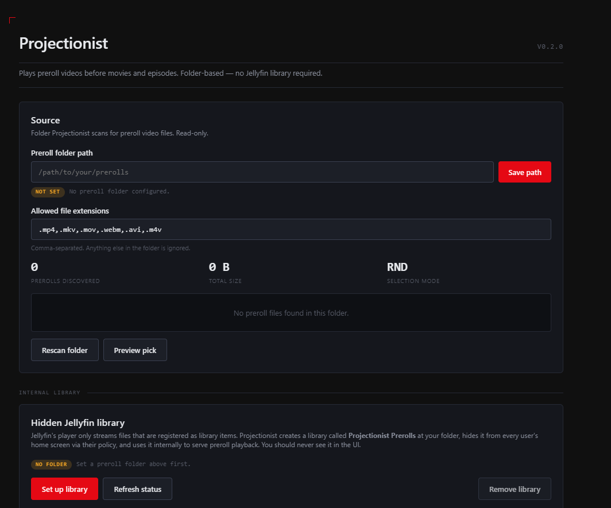
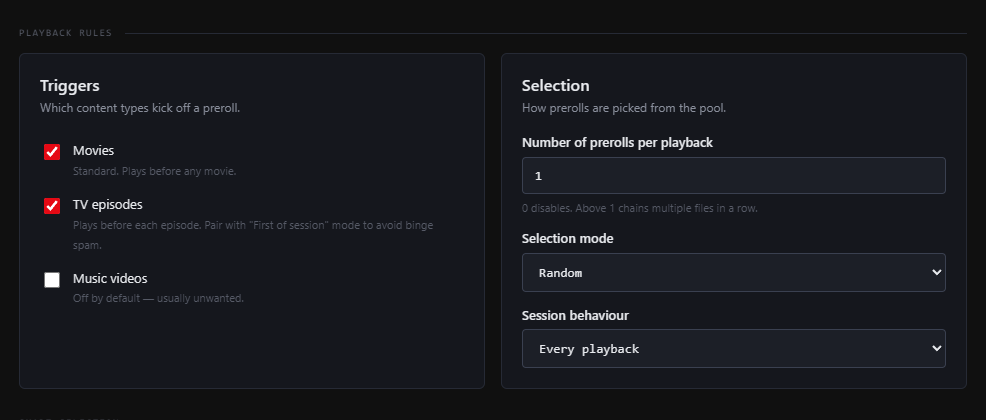
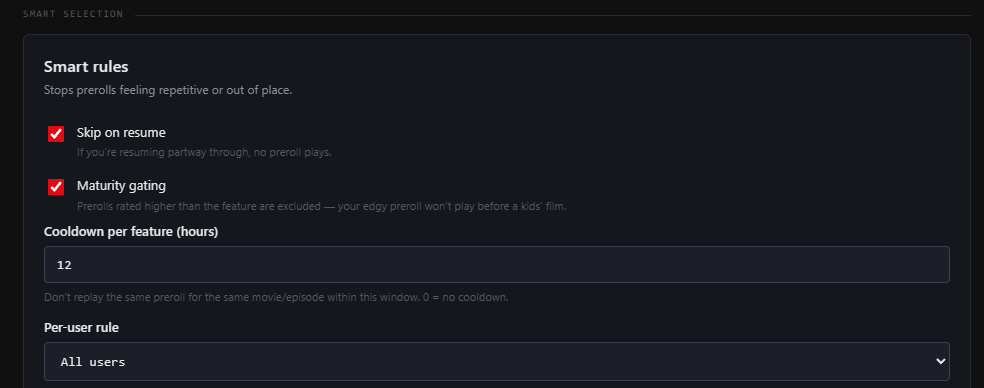
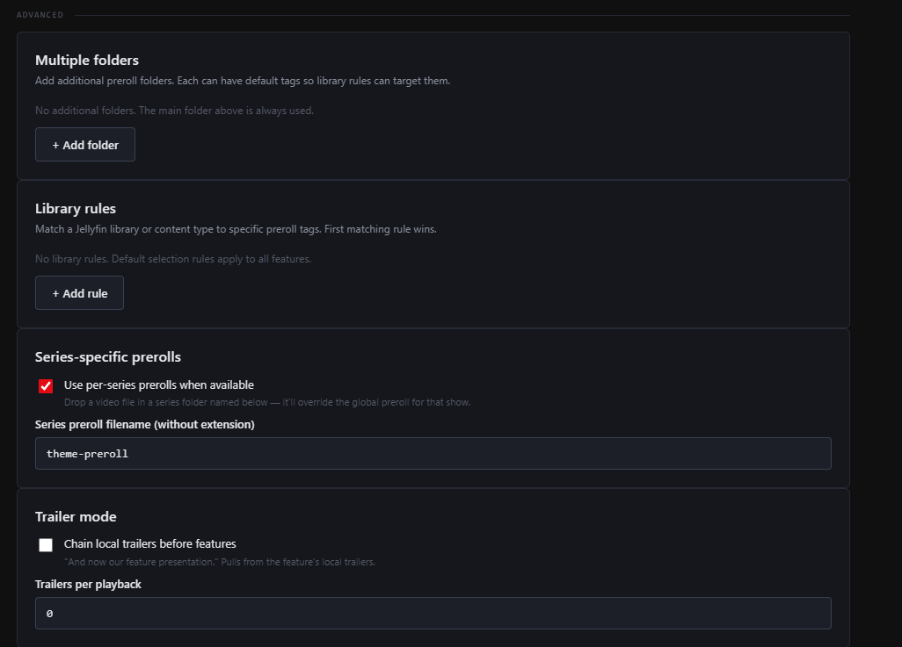
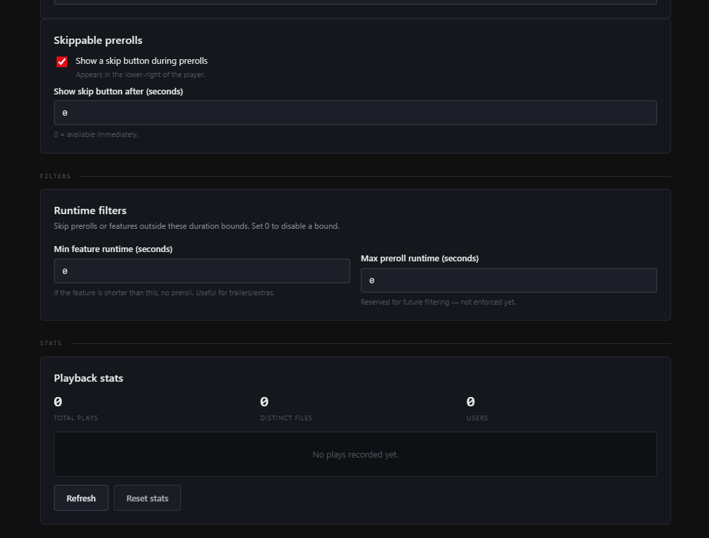
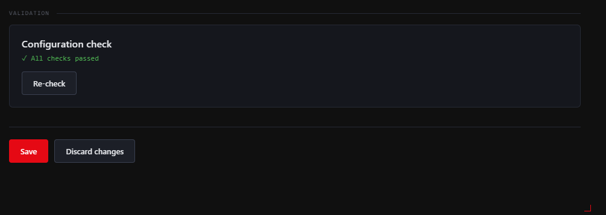

<p align="center">
  
</p>

```text
██████╗ ██████╗  ██████╗      ██╗███████╗ ██████╗████████╗██╗ ██████╗ ███╗   ██╗██╗███████╗████████╗
██╔══██╗██╔══██╗██╔═══██╗     ██║██╔════╝██╔════╝╚══██╔══╝██║██╔═══██╗████╗  ██║██║██╔════╝╚══██╔══╝
██████╔╝██████╔╝██║   ██║     ██║█████╗  ██║        ██║   ██║██║   ██║██╔██╗ ██║██║███████╗   ██║
██╔═══╝ ██╔══██╗██║   ██║██   ██║██╔══╝  ██║        ██║   ██║██║   ██║██║╚██╗██║██║╚════██║   ██║
██║     ██║  ██║╚██████╔╝╚█████╔╝███████╗╚██████╗   ██║   ██║╚██████╔╝██║ ╚████║██║███████║   ██║
╚═╝     ╚═╝  ╚═╝ ╚═════╝  ╚════╝ ╚══════╝ ╚═════╝   ╚═╝   ╚═╝ ╚═════╝ ╚═╝  ╚═══╝╚═╝╚══════╝   ╚═╝
```

<p align="center">
  
  
  
  
  
</p>

# 🎬 Projectionist for Jellyfin

A Jellyfin plugin that plays preroll videos before movies **and** TV episodes. Folder-based source — no Jellyfin library required. Custom-designed dark admin UI. Schedules, per-library rules, per-user rules, maturity gating, cooldowns, skippable prerolls, stats dashboard, and a lot more.

> Built because every other Jellyfin preroll plugin either (a) requires you to create a Jellyfin library full of preroll files that then clutters your homepage, or (b) only works for movies. Projectionist solves both.

---

## 📑 Table of contents

- [Core features](#-core-features) — source, triggers, smart selection, advanced rules, stats
- [Episode support](#-episode-support-its-not-trivial)
- [Installation](#️-installation)
- [First-time setup](#-first-time-setup)
- [Sidecar metadata](#-sidecar-metadata-tags-weights-schedules)
- [Screenshots](#-screenshots)
- [How it works](#-how-it-works)
- [Building from source](#-building-from-source)
- [Compatibility](#-compatibility)
- [License](#-license)

- 🗂️ **Folder-based.** Point at a folder and you're done. We create + manage the hidden Jellyfin library transparently and remove it from every user's home screen automatically.
- 📺 **Episodes too.** A bundled web-client patch (loaded via the FileTransformation plugin) hooks the playback manager so episodes also fetch intros, which the vanilla web client refuses to do.
- 🧠 **Smart selection.** Cooldown so you don't see the same intro on every rewatch. Maturity gating so your edgy ident doesn't play before *Bluey*. Skip-on-resume. First-of-binge for TV. Per-user rules.
- 🎃 **Seasonal / scheduled prerolls.** Drop a `halloween.mp4` and a `xmas.mp4` next to your default — they auto-trigger on the right dates.
- 📊 **Stats.** Per-file + per-user playback counters with a live dashboard.
- 🎨 **Custom dark admin UI.** Not the default Jellyfin form-on-grey look. Designed end-to-end.

---

## 🧩 Core features

### 🗂️ Source

- Folder-based discovery — **no library required**.
- Multiple preroll folders, each with default tags so library rules can target them.
- Optional sidecar metadata: `myfile.mp4.json` next to each video, OR a folder-level `prerolls.json`. Set per-file tags, weight, rating, and schedule.
- 6 video formats supported out of the box (`.mp4 .mkv .mov .webm .avi .m4v`), configurable.

### 🎬 Triggers

- **Movies, TV episodes, music videos** — toggle each independently.
- **TV episodes work** despite Jellyfin's web client only fetching intros for movies natively (we ship a tiny web-client patch).

### 🎲 Selection — 5 strategies

| Mode | Behaviour |
|------|-----------|
| **Random** | Uniform random pick (default) |
| **Sequential** | Round-robin across the pool |
| **Weighted** | Honour `weight` field from sidecar metadata |
| **Equal Rotation** | Strict per-rule fairness — every file plays equally often |
| **Recency Boost** | Newly-added files get 2× weight for their first week |

### 🧠 Smart selection

- **Skip on resume** — replaying from a partial position skips the intro
- **Maturity gating** — preroll's rating must not exceed the feature's. Stops your R-rated ident from running before a kids' movie
- **Cooldown per item** — don't replay the same preroll for the same movie within N hours (default 12)
- **Per-user rules** — pick "all users", "only these users" (kids profile only?), or "all except these" (admin gets nothing). Click chips to toggle
- **Session modes** — every playback / first of session / once per day / first of binge (don't replay during episodes 2+ of the same series)

### 🎯 Advanced

- **Multiple folders** — add as many as you want; each has default tags
- **Library rules** — match by Jellyfin library name and/or item type, require/exclude tags, or disable per rule. First match wins
- **Series-specific prerolls** — drop a `theme-preroll.mp4` (configurable name) in any series folder. Overrides global selection for that show
- **Trailer mode** — chain N local trailers from the feature's own metadata before it plays. Cinema-style "and now our feature presentation"
- **Skippable prerolls** — skip-button overlay during preroll playback with a configurable min-seconds delay

### 📊 Stats

- Per-file playback counts + last-played timestamps
- Per-user playback counts
- Persisted to `<jellyfin>/data/plugins/configurations/Projectionist.stats.json` so it survives restarts
- Reset button

### ✅ Validation

- One-click sanity check of your configuration. Tells you exactly what's missing and how to fix it ("hidden library not set up", "no preroll files found", "all content types disabled", etc.)

### 🙈 Hidden internal library

Jellyfin's player only streams files registered as library items. Projectionist creates a library called **Projectionist Prerolls** at your folder, hides it from every user via per-user policy preferences (`MyMediaExcludes`, `LatestItemExcludes`, `OrderedViews`), and uses it internally for playback. You should never see it in the UI — and if you do, click "Set up library" again to re-apply the hide.

---

## 📺 Episode support (it's not trivial)

Jellyfin's web/desktop/TV clients hard-code intro fetching to `Type === 'Movie'` only. Episodes never call `/Items/{id}/Intros`, so any plugin that just implements `IIntroProvider` can't do anything for episode playback.

Projectionist works around this with a small JavaScript hook that monkey-patches `playbackManager.play()`. When the user plays an episode, the hook fetches `/Items/{episodeId}/Intros` itself and prepends the result to the play options. The script is injected into Jellyfin's `index.html` via two parallel paths — an in-process ASP.NET `IStartupFilter` middleware AND a registration with the FileTransformation plugin (whichever fires first wins).

This is the same pattern Achievement Badges, StarTrack, and other "real" plugins use. It just works.

---

## 🛠️ Installation

### Manual install

1. Grab `Jellyfin.Plugin.Projectionist.dll` and `meta.json` from [Releases](https://github.com/ZL154/jellyfin-projectionist/releases).
2. Create a folder in your Jellyfin plugins directory:
   - **Docker:** `<config-volume>/plugins/Projectionist_1.0.0.0/`
   - **Bare metal:** `<jellyfin-data>/plugins/Projectionist_1.0.0.0/`
3. Copy both files into that folder.
4. **Install the FileTransformation plugin** if you don't already have it (required for episode support — movies work without it).
5. Restart Jellyfin.
6. Dashboard → Plugins → Projectionist → configure.

### Plugin repository (coming soon)

Once a public manifest is published, you'll be able to add the repo URL to **Dashboard → Plugins → Repositories** for one-click install + auto-updates.

---

## 🚀 First-time setup

1. **Drop your preroll videos** in any folder Jellyfin can read.
2. **Open Projectionist settings** → set the **Preroll folder path** → click **Save path**.
3. Scroll to the **Internal Library** card → click **Set up library**. This creates the hidden Jellyfin library at your folder, scans it, and applies the hide to every user. Wait for the status pill to flip to **Library OK**.
4. Pick which content types should trigger a preroll (Movies, TV episodes, etc.).
5. Save.
6. Play any movie — preroll plays. Play any episode — preroll plays. Open the dev console and you should see `[Projectionist] queueing N preroll(s) before episode <name>` for episodes.

---

## 📝 Sidecar metadata (tags, weights, schedules)

Drop `myfile.mp4.json` next to a video to override its discovery defaults:

```json
{
  "tags": ["halloween", "spooky"],
  "weight": 2.0,
  "rating": "PG-13",
  "schedule": {
    "months": [10],
    "dateRange": "10-15..10-31"
  }
}
```

Or use a single folder-level `prerolls.json`:

```json
{
  "halloween.mp4": {
    "tags": ["halloween"],
    "schedule": { "months": [10] }
  },
  "xmas.mp4": {
    "tags": ["xmas"],
    "schedule": { "dateRange": "12-15..12-31" }
  },
  "anime-default.mp4": {
    "tags": ["anime"],
    "weight": 1.5
  }
}
```

Then add a library rule in the UI: `Library Name = "Anime"` → `RequireTags = anime`. Done — your anime library uses anime-tagged prerolls.

### Schedule shape

```ts
type ScheduleRule = {
  months?: number[];          // 1-12
  daysOfWeek?: number[];      // 0=Sunday .. 6=Saturday
  startHour?: number;         // 0-23 inclusive
  endHour?: number;           // 0-24 exclusive
  dateRange?: string;         // "MM-DD..MM-DD" (handles year-wrap)
};
```

---

## 📷 Screenshots

### Source + Internal Library



### Playback Rules



### Smart Selection



### Advanced — Folders, Library rules, Series, Trailer mode



### Skippable, Filters, Stats



### Validation



---

## 🔧 How it works

The plugin implements `MediaBrowser.Controller.Library.IIntroProvider` — Jellyfin's official "play this before that" hook. When playback starts, Jellyfin asks every registered `IIntroProvider` for items to play first.

For movies that's the whole story. The provider:

1. Checks the requested item's content type against the enabled-content-type config
2. Checks per-user inclusion / exclusion
3. Checks resume position (if enabled, skip if resuming)
4. Checks session mode (FirstOfSession / OncePerDay / FirstOfBinge)
5. Looks for a per-series preroll if the feature is an episode and `EnableSeriesPrerolls` is on
6. Otherwise discovers candidates from all configured folders, applies schedule + maturity + tag + cooldown filters
7. Picks N according to the selection mode
8. (Optional) prepends N local trailers
9. Resolves each pick via the hidden library to get a real `BaseItem.Id` (required for `MediaSourceInfo` lookup)
10. Records cooldown, stats, session bookkeeping

For **episodes**, the bundled JavaScript hook calls the same endpoint client-side because Jellyfin's web/desktop/TV clients won't.

The hidden internal library exists because Jellyfin's player resolves `MediaSourceInfo` via `BaseItem.Id` — a path-only intro returns successfully but silently fails to stream. The library gives our prerolls real `BaseItem` IDs without the user having to manage a Jellyfin library themselves.

---

## 🏗️ Building from source

Requires .NET SDK 9.0.

```bash
git clone https://github.com/ZL154/jellyfin-projectionist
cd jellyfin-projectionist
dotnet build src/Projectionist/Projectionist.csproj -c Release
# DLL output: src/Projectionist/bin/Release/net9.0/Jellyfin.Plugin.Projectionist.dll
# meta.json:  src/Projectionist/meta.json
```

Or use the bundled PowerShell build script (zips everything for upload):

```powershell
./build/build.ps1
# Produces: build-output/Projectionist_<version>.zip
```

Targets Jellyfin 10.11 ABI (`Jellyfin.Controller` 10.11.0).

---

## 📋 Compatibility

| Jellyfin | Status |
|----------|--------|
| 10.11.x  | ✅ tested |
| 10.10.x  | ⚠️ untested (needs ABI bump in csproj + meta.json) |

Movie support has zero dependencies. **Episode support** requires the [FileTransformation](https://github.com/IAmParadox27/jellyfin-plugin-file-transformation) plugin (any version, autodetected at runtime).


---

## 📜 License

MIT — see [LICENSE](LICENSE).
